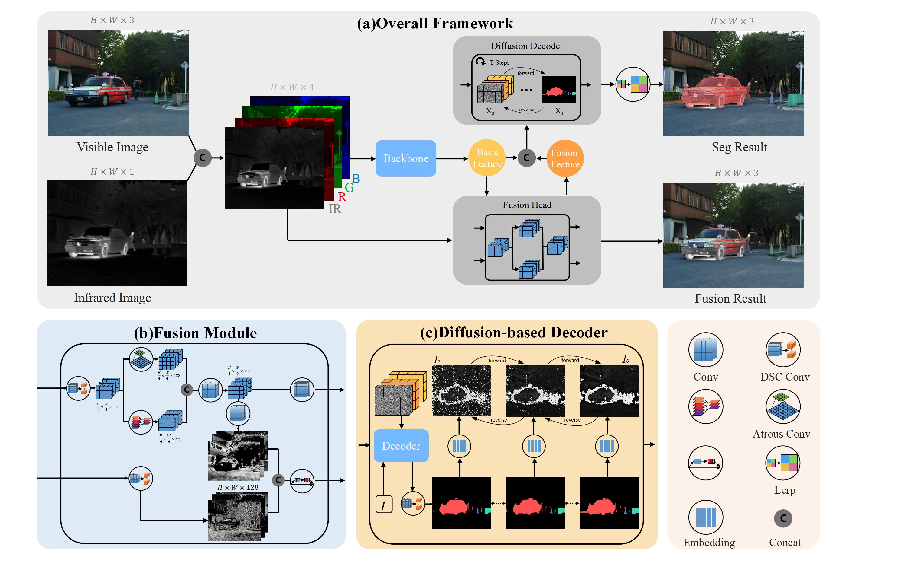

# DiFusionSeg
This is official Pytorch implementation of "[DiFusionSeg: Diffusion-Driven Semantic Segmentation with Multi-modal Fusion for Perception Optimization]()"
 - 
```
@article{
}
```
## Framework


## Recommended Environment
 - [ ] torch  1.13.1
 - [ ] cudatoolkit 11.8
 - [ ] torchvision 0.14.0
 - [ ] mmcv  2.2.1
 - [ ] mmcv-full 1.7.2
 - [ ] mmsegmentation 0.30.0
 - [ ] numpy  1.26.4
 - [ ] opencv-python 4.10.0.84

## Experiments 
### Dataset
If you need to evaluate other datasets, please organize them as follows:
```
├── /dataset
    MSRS/
    ├── test
    │   ├── ir
    │   ├── Segmentation_labels
    │   ├── Segmentation_visualize
    │   └── vi
    └── train
        ├── ir
        ├── Segmentation_labels
        └── vi
    MFD/
    ├── test
    │   ├── ir
    │   ├── Segmentation_labels
    │   ├── Segmentation_visualize
    │   └── vi
    ├── test_day
    │   ├── ir
    │   ├── Segmentation_labels
    │   └── vi
    ├── test_night
    │   ├── ir
    │   ├── Segmentation_labels
    │   └── vi
    └── train
        ├── ir
        ├── Segmentation_labels
        └── vi
    ......
```
### Evaluate model
python
```
python test_model.py
```
### To Train
Before training DiFusionSeg, you need to download the MSRS dataset MSRS and putting it in ./datasets.

Then running 
python
```
python train_model.py
```
### Segmentation comparison

### Fusion comparison

## If this work is helpful to you, please cite it as：
```
@article{
}
```
## Acknowledgements
