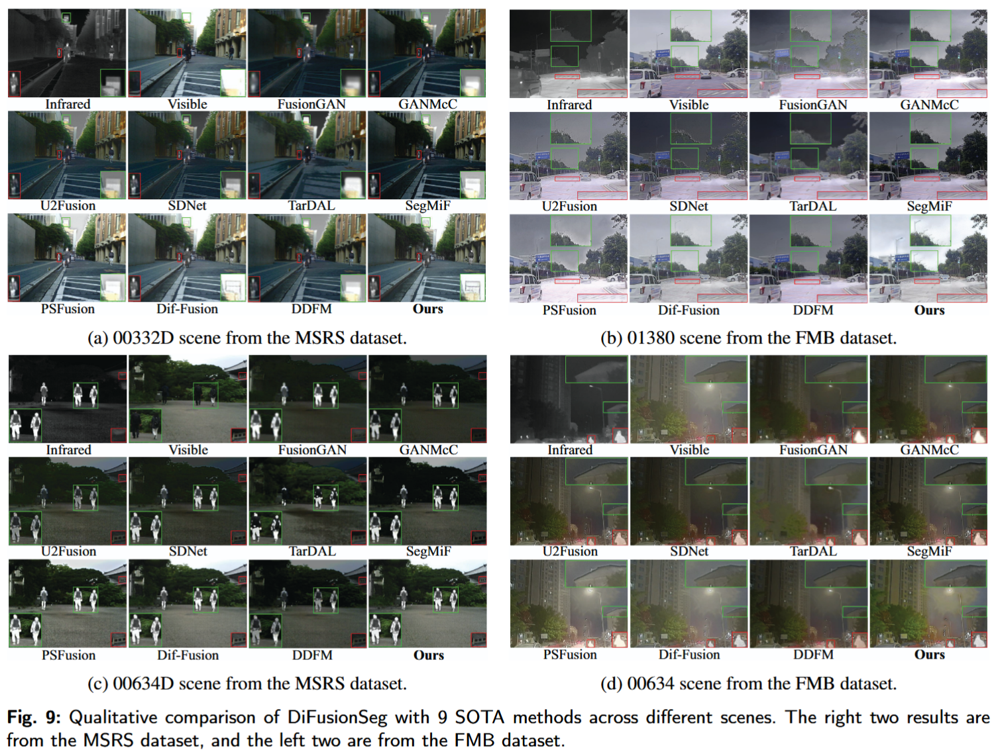

# DiFusionSeg
This is official Pytorch implementation of "[DiFusionSeg: Diffusion-Driven Semantic Segmentation with Multi-modal Fusion for Perception Optimization]()"
 - 
```
@article{
}
```
## Framework


## Recommended Environment
 - [ ] torch  1.13.1
 - [ ] cudatoolkit 11.8
 - [ ] torchvision 0.14.0
 - [ ] mmcv  2.2.1
 - [ ] mmcv-full 1.7.2
 - [ ] mmsegmentation 0.30.0
 - [ ] numpy  1.26.4
 - [ ] opencv-python 4.10.0.84

## Experiments 
### Dataset & Checkpoints & Results
The checkpoints and results can be in [DiFusionSeg](https://www.dropbox.com/scl/fo/zjbyp7pml54epiz8wg4gj/AIGFfGfG8Ea_XU25WwyxQno?rlkey=1ywmahphox5f4kdqfrr8h1234&st=mag0vanh&dl=0). Download MSRS dataset from [MSRS](https://pan.baidu.com/s/18q_3IEHKZ48YBy2PzsOtRQ?pwd=MSRS) and the MFNet dataset from [MFNet](https://www.mi.t.u-tokyo.ac.jp/static/projects/mil_multispectral/).
If you need to evaluate other datasets, please organize them as follows:
```
├── /dataset
    MSRS/
    ├── test
    │   ├── ir
    │   ├── Segmentation_labels
    │   ├── Segmentation_visualize
    │   └── vi
    └── train
        ├── ir
        ├── Segmentation_labels
        └── vi
    MFD/
    ├── test
    │   ├── ir
    │   ├── Segmentation_labels
    │   ├── Segmentation_visualize
    │   └── vi
    ├── test_day
    │   ├── ir
    │   ├── Segmentation_labels
    │   └── vi
    ├── test_night
    │   ├── ir
    │   ├── Segmentation_labels
    │   └── vi
    └── train
        ├── ir
        ├── Segmentation_labels
        └── vi
    ......
```
### Evaluate model
python
```
python test_model.py
```
### run sample
python
```
python test_demo.py --img="./images/00131D_vi.png" --ir="./images/00131D_ir.png" --checkpoint="./exps/Done/msrs_vi_ir_meanstd_ConvNext_fusioncomplex_8083/best.pth" --segout="./seg.png"
```
### To Train
Before training DiFusionSeg, you need to download the MSRS dataset MSRS and putting it in ./datasets.

Then running 
python
```
python train_model.py
```
### Segmentation comparison

### Fusion comparison

## If this work is helpful to you, please cite it as：
```
@article{WANG2025114481,
title = {DiFusionSeg: Diffusion-Driven Semantic Segmentation with Multi-Modal image Fusion for Enhanced Perception},
journal = {Knowledge-Based Systems},
pages = {114481},
year = {2025},
issn = {0950-7051},
doi = {https://doi.org/10.1016/j.knosys.2025.114481},
url = {https://www.sciencedirect.com/science/article/pii/S0950705125015205},
author = {Zhiwei Wang and Defeng He and Li Zhao and Bo Liu and Yayu Zheng and Xiaoqin Zhang},
keywords = {Infrared image, Visible image, Image fusion, Semantic segmentation, Diffusion model,},
abstract = {Multi-modal data fusion harnesses complementary information from diverse sensors to enhance the comprehension of scenes. While multi-modal image integration enriches tasks like semantic segmentation, differing objectives of fusion and segmentation can cause conflicts that degrade performance. Existing methods fail to achieve an optimal trade-off between visual fusion quality and segmentation accuracy. This paper proposes DiFusionSeg, a novel fusion and segmentation model that employs a joint optimization framework to alleviate conflicts between the fusion and segmentation tasks. It not only generates fusion results with exceptional visual fidelity but also ensures precise segmentation. Through the carefully designed high-fidelity texture fusion module and diffusion-based segmentation module, DiFusionSeg effectively injects semantic guidance into the fusion process and enhances segmentation performance through denoising and feature fusion. Extensive comparative experiments on public RGB-T semantic segmentation datasets demonstrate that DiFusionSeg outperforms many state-of-the-art (SOTA) models (80.83% mIoU on MSRS, 59.6% mIoU on MFD). Additionally, it generates fusion results with exceptional visual fidelity. The source code and results will be released at https://github.com/warren-wzw/DiFusionSeg.}
}
```
## Acknowledgements
We use MMSegmentation, DDP as the correspond codebase. We would like to express our sincere gratitude to the developers of these codebases.